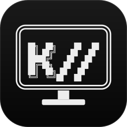
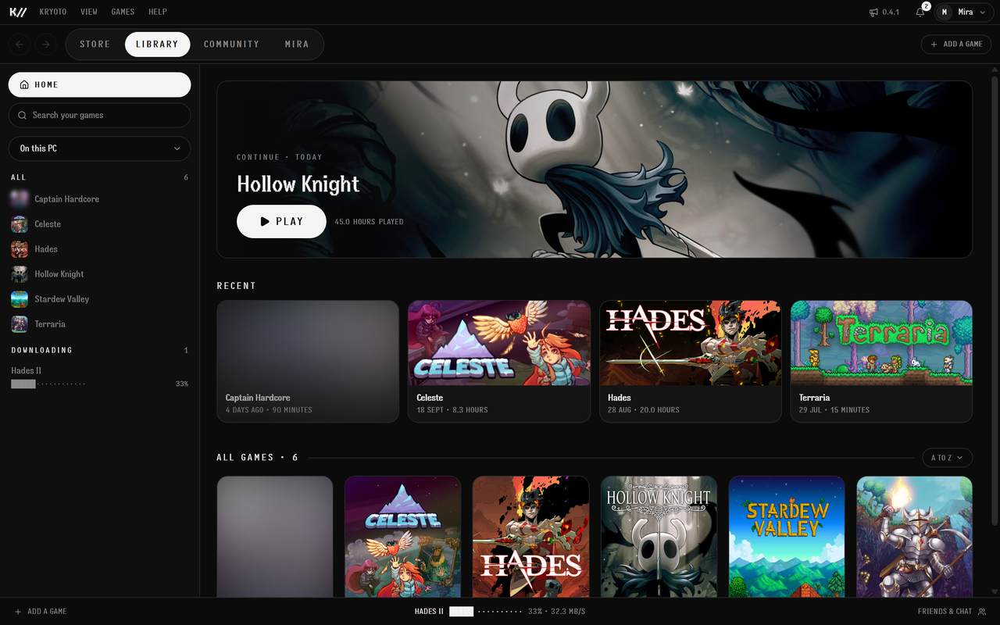
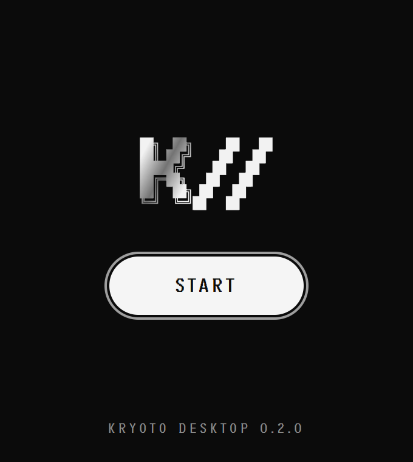
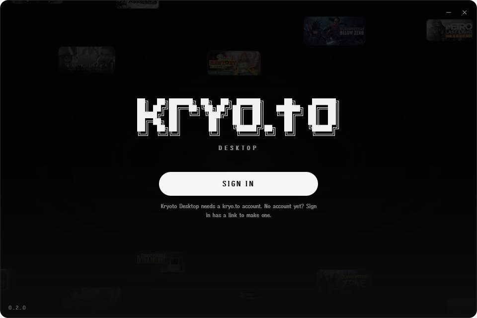
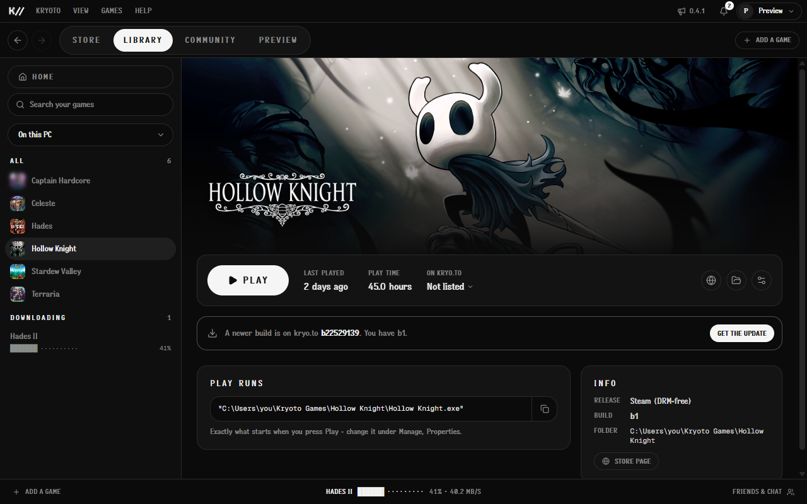
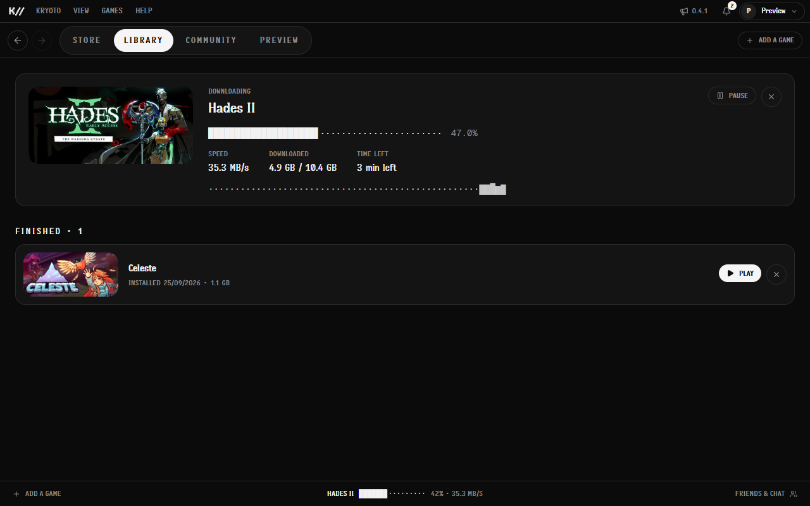
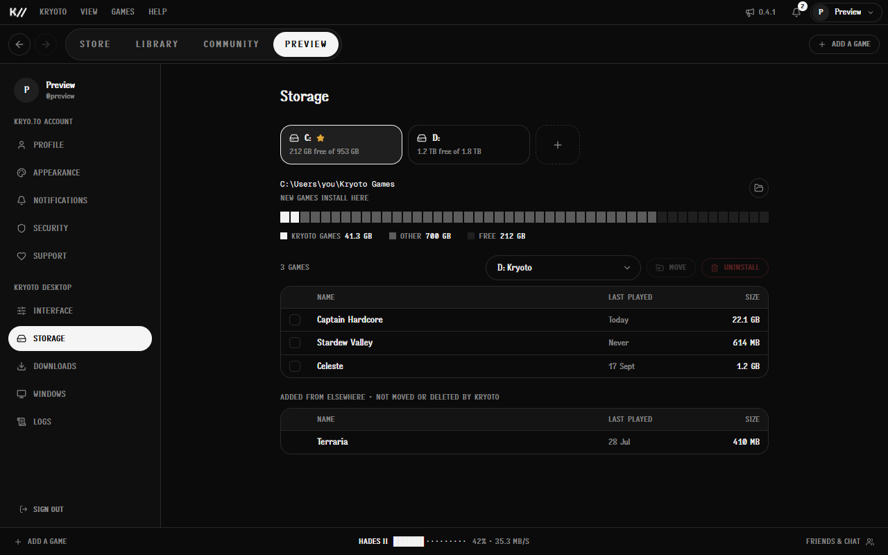
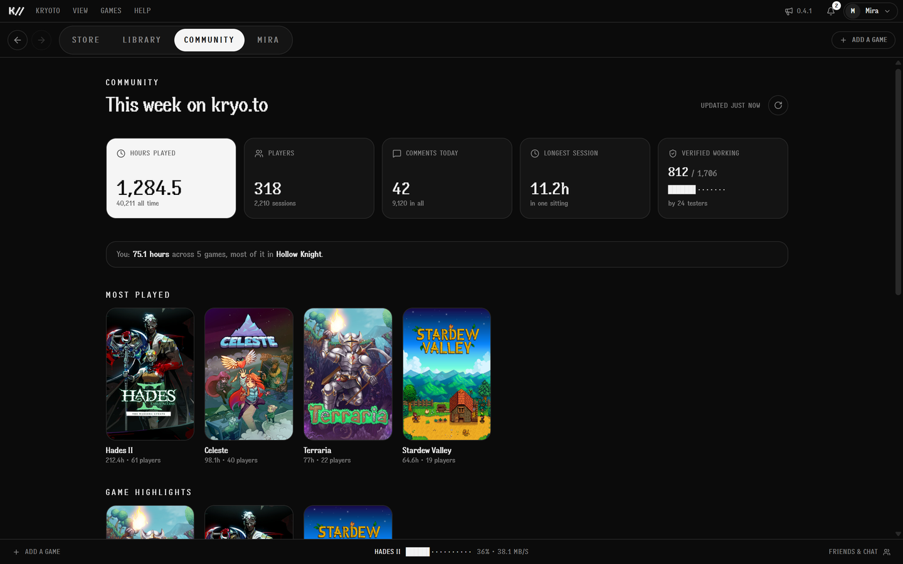
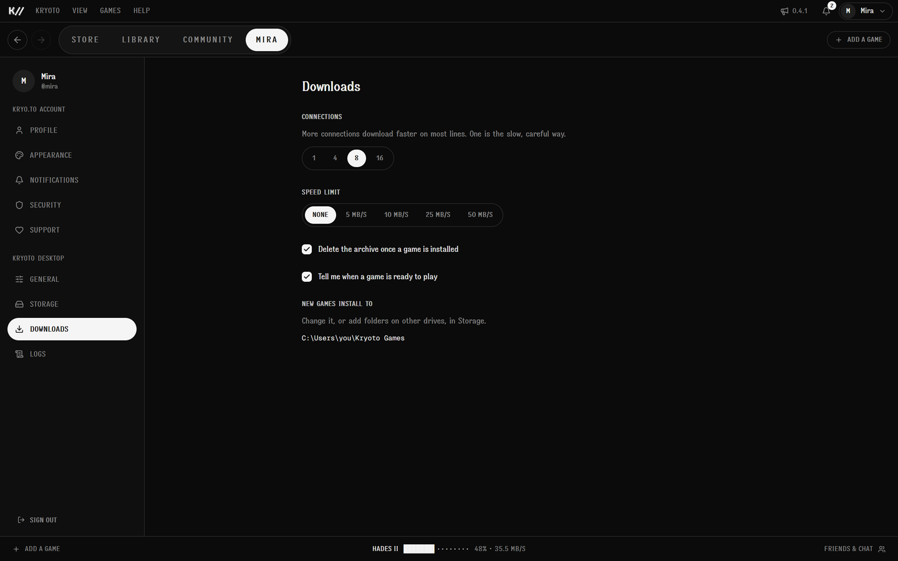

<p align="center"></p>

# Kryoto Desktop

<p align="center">
  <a href="https://github.com/kyrotooooo/kryoto-desktop/stargazers"></a>
  <a href="https://github.com/kyrotooooo/kryoto-desktop/releases/latest"></a>
  <a href="https://kryo.to/desktop"></a>
</p>

Kryoto Desktop is an app where you manage everything on Kryoto in one place: find a game, download it and play it. Runs on Windows and Linux.

**It is open source.** Read exactly what runs on your PC, build it yourself, report a bug or send a fix. If you like it, a star helps other people find it.



| | |
|---|---|
|  |  |
|  |  |
|  |  |
|  | |

## Run it

```text
pnpm install
pnpm app:dev      # the app
pnpm dev          # the UI alone in a browser, on sample data (http://localhost:1421)
pnpm app:build    # the installer (NSIS on Windows, AppImage/.deb on Linux)
```

`app:build` remaps the build machine's paths out of the binary and refuses to
finish if the home folder is still in it.

Debug builds run as `to.kryo.desktop.dev`, next to an installed copy without
sharing its data, and never send error reports.

## Where things are

| | |
|---|---|
| `src-tauri/src/lib.rs` | the Store web view, what kryo.to reports (account, inbox, lists), commands |
| `src-tauri/src/downloads.rs` | taking over kryo.to downloads, resume, space checks, unpacking, install |
| `src-tauri/src/launch.rs` | what Play runs: Steam launch entries, launch options, Wine/Proton |
| `src-tauri/src/library.rs` | `library.json`, play/stop, play time, uninstall |
| `src-tauri/src/storage.rs` | library folders, drive space, moving games between drives |
| `src-tauri/src/system.rs` | tray, single instance, start with Windows, the pop-up menu window |
| `src-tauri/src/logging.rs` | the log file, crash capture, reports to kryo.to |
| `src/boot` | the start box and sign-in |
| `src/shell`, `src/library`, `src/downloads`, `src/settings`, `src/community`, `src/friends` | the app |
| `src/ui/ascii` | the K// mark (traced from kryo.to's) and the block lettering, as vectors |
| `scripts/brand.mjs` | icons and installer art, generated from the same code |

## Tests

```text
pnpm build                   # typecheck + build the UI
cd src-tauri && cargo test
cd src-tauri && cargo clippy --all-targets -- -D warnings
```

CI (`.github/workflows/ci.yml`) runs all of that on every push and pull
request, on Ubuntu and on Windows, and checks that the three version fields
agree.

## Releases

Bump the version in `package.json`, `src-tauri/Cargo.toml` and
`src-tauri/tauri.conf.json` together, add the entry to kryo.to's changelog,
and push to main. `.github/workflows/release.yml` sees the new version, builds
the Windows installer, the AppImage and the .deb with `pnpm app:build`, and
publishes them as release `v<version>`. kryo.to/desktop offers the newest
release by itself; its `GITHUB_FORGE_TOKEN` needs Contents: read on this
repository.

`KRYOTO_STAND_IN=<folder with "Captain Hardcore.exe"> cargo test -- --ignored`
also starts a real process the way Play does, against a stand-in that writes
its arguments to `launch-log.txt`.

Changes are listed in kryo.to's changelog; this app has none of its own.

## Star history

<a href="https://star-history.com/#kyrotooooo/kryoto-desktop&Date">
  <picture>
    <source media="(prefers-color-scheme: dark)" srcset="https://api.star-history.com/svg?repos=kyrotooooo/kryoto-desktop&type=Date&theme=dark" />
    
  </picture>
</a>

kryo.to/desktop shows the same count and history, read from GitHub's API (`lib/desktop-repo.ts` in kryo.to).
